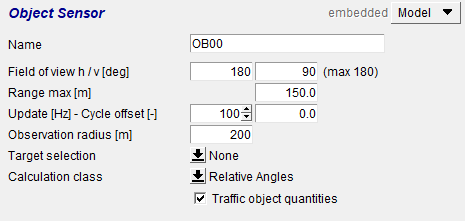
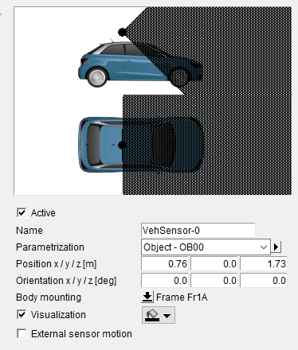

# Ansys AVxcelerate and CarMaker Co-simulation

Ansys AVxcelerate (AVX) is a robust simulation tool that offers detailed physics-based modeling of LiDAR systems, capturing real-world sensor components and environmental interactions across various laser bandwidths.

AVX's adaptability extends to various LiDAR technologies, thanks to its powerful GPU-accelerated ray-tracing capabilities.

We employ co-simulation, which combines AVX and CarMaker (IPG Automotive product) for a more comprehensive simulation framework. CarMaker specializes in virtual vehicle testing, from basic simulations to complex systems involving driver assistance and powertrains.

These tools, combined in co-simulation, concurrently simulate vehicle physics and sensor performance, enhancing accuracy and understanding. In this setup, CarMaker simulates vehicle dynamics and driving environments, while AVX handles sensor simulations.

This co-simulation is used in this study to build diverse scenarios and generate the desired synthetic dataset, allowing sensor placement optimization, parameter fine-tuning, and improved vehicle performance.

## Mapping the Modeled LiDAR Sensor to CarMaker for Co-simulation

The mapping of our modeled sensor to CarMaker involves key steps primarily utilizing the simulation parameter file and sensor configuration file.

The Co-simulation-Map file is particularly important in this process, as it creates a link between AVX and CarMaker's assets. This connection facilitates the efficient co-simulation, blending Ansys' sensor simulation with CarMaker's vehicle dynamics and environment simulations.

## Implementing CarMaker's Object Sensor

CarMaker's Object Sensor is used to detect Traffic Objects within the TestRun and calculate their 3D bounding boxes. The sensor is configured to cover a broad detection range: horizontal span of 180°, vertical span of 90°, longitudinal range of 150m, and an observation radius of 200m. The extensive coverage ensures accurate generation of 3D bounding boxes for objects intersecting with the Velodyne sensor's beams.

The environment is scanned at a frequency set at ten times the rotation rate of the Velodyne sensor, facilitating separate object scans for each point cloud and accommodating dynamic scenes.

The Object Sensor's position and orientation align with the LiDAR model, ensuring the generated 3D bounding boxes accurately reflect the sensor's perspective.

Refer to Figures 1.1a and 1.1b for visual representation of the Object Sensor's parameters and mounting.

<!-- 
*Figure 1.1a: Depicting the key parameters of CarMaker's Object Sensor. Courtesy of [IPG Automotive](https://ipg-automotive.com/en/products-solutions/software/carmaker/).*

*Figure 1.1b: Illustrating the mounting procedure, showcasing the position, orientation, and attachment of the Object Sensor. Courtesy of [IPG Automotive](https://ipg-automotive.com/en/products-solutions/software/carmaker/).*  -->

<figure>
  
  <figcaption>Figure 1.1a: Depicting the key parameters of CarMaker's Object Sensor. Courtesy of <a href="https://ipg-automotive.com/en/products-solutions/software/carmaker/">IPG Automotive</a>.</figcaption>
</figure>

<figure>
  
  <figcaption>Figure 1.1b: Illustrating the mounting procedure, showcasing the position, orientation, and attachment of the Object Sensor. Courtesy of <a href="https://ipg-automotive.com/en/products-solutions/software/carmaker/">IPG Automotive</a>.</figcaption>
</figure>
