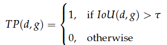
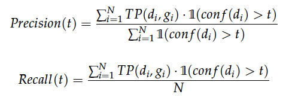
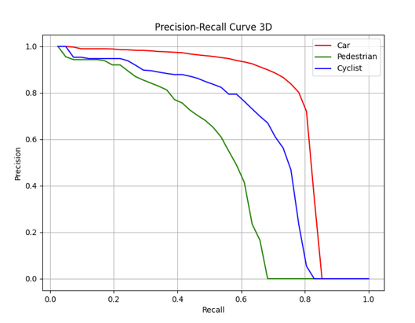
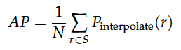
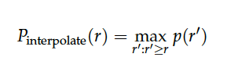
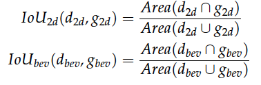
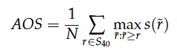
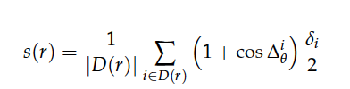
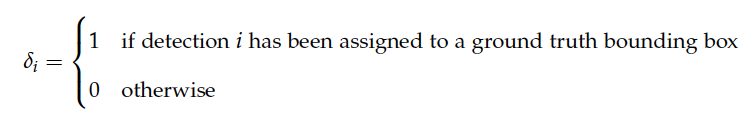

# Evaluation Metrics
The selection of [KITTI Evaluation Metrics](https://www.cvlibs.net/datasets/kitti/eval_object.php?obj_benchmark=3d) in this research for network performance assessment is guided by key considerations:

1. The primary goal of this research is to generate KITTI-like point clouds by replicating the renowned KITTI data set. The similarity of the produced data to the KITTI set makes its evaluation metrics relevant and suited to this study.

2. Furthermore, the extensive usage of the KITTI benchmark suite in autonomous driving research highlights its utility for comparative performance analyses.

This suite includes metrics such as [AP 2D](https://www.cvlibs.net/datasets/kitti/eval_object.php?obj_benchmark=2d),  [AP 3D](https://www.cvlibs.net/datasets/kitti/eval_object.php?obj_benchmark=3d),  [AP Bird's Eye View (BEV)](https://www.cvlibs.net/datasets/kitti/eval_object.php?obj_benchmark=bev) and [Average Orientation Similarity (AOS)](https://www.cvlibs.net/publications/Geiger2012CVPR.pdf).

The understanding and interpretation of the AP metric form the cornerstone of assessing the performance of object detection tasks. This metric is primarily discussed in relation to the detection of 'Car', 'Pedestrian', and 'Cyclist' classes.

Each detected object is predicted with a bounding box parameterized by the center coordinates `(x, y, z)`, width `w`, length `l`, height `h`, and yaw angle `θ`. A corresponding confidence score also quantifies the certainty level of the detection.

The following part focuses primarily on [AP 3D](https://www.cvlibs.net/datasets/kitti/eval_object.php?obj_benchmark=3d), which classifies detections as either true positives or false positives based on their 3D Intersection over Union (IoU) with the ground truth bounding boxes. For each detection `d` and the corresponding ground truth box `g`, the 3D IoU is computed as follows:

<figure>
  
  <figcaption></figcaption>
</figure>

In this equation, d_3d and g_3d are the 3D representations of the predicted and ground truth bounding boxes, respectively.

To simplify the notation going forward, the terms d_3d, g_3d, and IoU_3d will be denoted as d, g, and IoU, respectively.

A detection `d` is classified as a true positive if its IoU with a ground truth box `g` surpasses a certain threshold `τ`. It's essential to note that this threshold is subject to the type of object: `τ` is designated as `0.7` for cars and `0.5` for pedestrians and cyclists.

This is represented by the following formula:

<figure>
  
  <figcaption></figcaption>
</figure>

For each confidence threshold `t`, corresponding precision and recall are calculated using these formulas:

<figure>
  
  <figcaption></figcaption>
</figure>

Here, `conf(d)` signifies the confidence of detection `d`, `N` represents the total number of ground truth boxes. `1(.)` functions as an indicator function that returns 1 if the condition within the parentheses is met, and 0 otherwise

These calculated pairs create a Precision-Recall (PR) curve when plotted. For instance, the below figure illustrates a PR curve.

<figure>
  
  <figcaption></figcaption>
</figure>

The PR curve illustration represents three classes: 'Car' (red), 'Pedestrian' (green), and 'Cyclist' (blue). Different applications prioritize different areas on this curve. For instance, autonomous driving prioritizes high recall, especially for pedestrian detection, to minimize accidents. This scenario corresponds to a low confidence threshold, which generates a significant number of detections, thereby ensuring nearly all positive samples are detected.

To summarize the PR curve, we use a single metric, the Average Precision (AP). AP is defined as the mean precision at a subset `S` of `N` equally spaced recall levels `[q0, q0 + (q1-q0)/(N-1), q0 + 2*(q1-q0)/(N-1), ..., q1]`, beginning at recall level `q0` and ending at level `q1`.

This can be expressed using the formula:

<figure>
  
  <figcaption></figcaption>
</figure>

To maintain the monotonicity of the PR curve, the precision at each recall level `r` is interpolated by the maximum precision at recall values greater or equal to `r`, defined as:

<figure>
  
  <figcaption></figcaption>
</figure>

The original KITTI benchmark used the well-known 11-Point interpolated AP metric, assessing a subset of 11 recall levels at `S_11 = [0, 0.1, 0.2, ..., 1]`. However, a more recent [40-Point interpolated AP metric has been introduced and adopted by the KITTI benchmark as of October 8, 2019](https://www.cvlibs.net/datasets/kitti/eval_object.php?obj_benchmark=3d). The revised recall levels now are at `S_40 = [1/40, 2/40, 3/40, ..., 1]`. This thesis follows this methodology and calculates APs using the 40-Point interpolation.

The metrics AP_2D, AP_3D, and AP_BEV all operate under similar principles, but the computation of the IoU differs. For the AP_2D metric, the bounding box prediction `d_2d` and the corresponding ground truth `g_2d` are represented in the 2D image plane. On the other hand, for the AP_BEV metric, the detection and ground truth boxes are represented in a top-down bird's eye view (BEV), represented as `d_bev` and `g_bev` respectively. The IoUs for these scenarios are calculated as follows:

<figure>
  
  <figcaption></figcaption>
</figure>

In these formulas, `d_2d`, `g_2d`, `d_bev`, and `g_bev` represent the 2D and BEV representations of the predicted and ground truth bounding boxes, respectively.

Contrary to the metrics mentioned before, the Average Orientation Similarity (AOS) takes into account the difference between the head and tail of objects. The computation for this metric is as follows:

<figure>
  
  <figcaption></figcaption>
</figure>

In this formula, `r` signifies the recall, calculated using the 2D representations of both detections and ground truths. The symbol `s(r)` represents the orientation similarity at a recall rate of `r`.

The orientation similarity, `s(r)`, is a normalized version of the cosine similarity and can be formulated as:

<figure>
  
  <figcaption></figcaption>
</figure>

Here, `D(r)` denotes all object detections at a recall rate `r`. The term `Δθ_i` signifies the angular discrepancy between the ground truth and predicted orientations for the `i-th` detection.

Moreover, to account for multiple detections corresponding to a single object, a penalty term, represented as `δ_i`, is introduced. This term is defined as follows:

<figure>
  
  <figcaption></figcaption>
</figure>

This penalty term is `1` if a match has been found between detection `i` and a ground truth bounding box, and `0` in the absence of a match.

