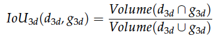

# Evaluation Metrics
The selection of [KITTI Evaluation Metrics](https://www.cvlibs.net/datasets/kitti/eval_object.php?obj_benchmark=3d) in this research for network performance assessment is guided by key considerations:

1. The primary goal of this research is to generate KITTI-like point clouds by replicating the renowned KITTI data set. The similarity of the produced data to the KITTI set makes its evaluation metrics relevant and suited to this study.

2. Furthermore, the extensive usage of the KITTI benchmark suite in autonomous driving research highlights its utility for comparative performance analyses.

This suite includes metrics such as [AP 2D](https://www.cvlibs.net/datasets/kitti/eval_object.php?obj_benchmark=2d),  [AP 3D](https://www.cvlibs.net/datasets/kitti/eval_object.php?obj_benchmark=3d),  [AP Bird's Eye View (BEV)](https://www.cvlibs.net/datasets/kitti/eval_object.php?obj_benchmark=bev) and [Average Orientation Similarity (AOS)](https://www.cvlibs.net/publications/Geiger2012CVPR.pdf).

The understanding and interpretation of the AP metric form the cornerstone of assessing the performance of object detection tasks. This metric is primarily discussed in relation to the detection of 'Car', 'Pedestrian', and 'Cyclist' classes.

Each detected object is predicted with a bounding box parameterized by the center coordinates `(x, y, z)`, width `w`, length `l`, height `h`, and yaw angle `θ`. A corresponding confidence score also quantifies the certainty level of the detection.

The following part focuses primarily on [AP 3D](https://www.cvlibs.net/datasets/kitti/eval_object.php?obj_benchmark=3d), which classifies detections as either true positives or false positives based on their 3D Intersection over Union (IoU) with the ground truth bounding boxes. For each detection `d` and the corresponding ground truth box `g`, the 3D IoU is computed as follows:

<figure>
  
  <figcaption></figcaption>
</figure>

In this equation, d_3d and g_3d are the 3D representations of the predicted and ground truth bounding boxes, respectively.

To simplify the notation going forward, the terms d_3d, g_3d, and IoU_3d will be denoted as d, g, and IoU, respectively.