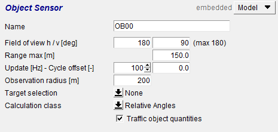
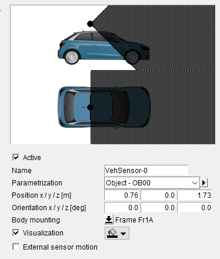
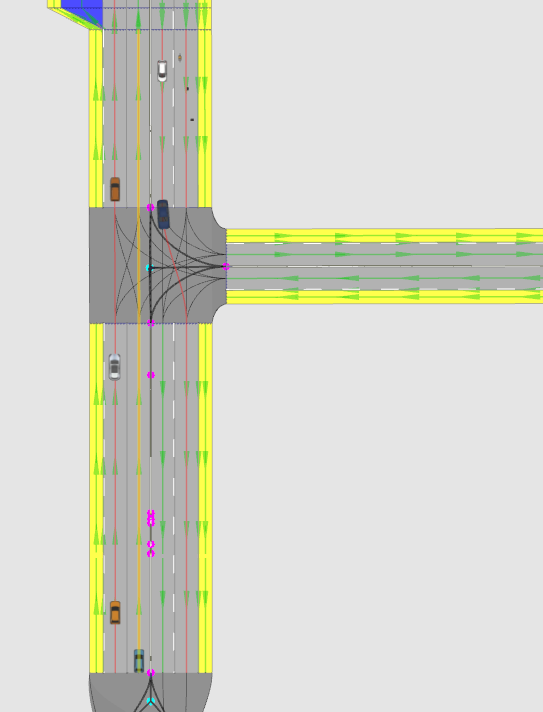
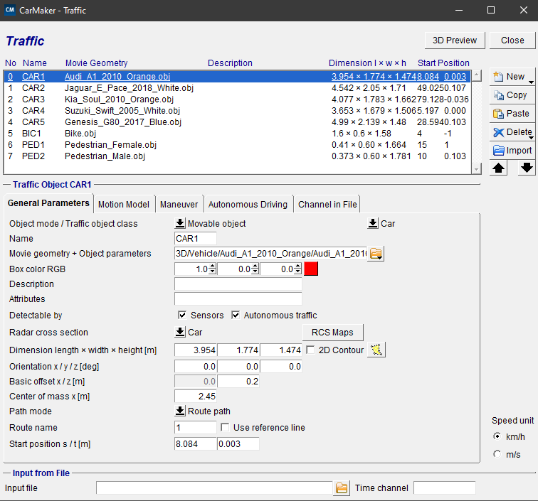

# Ansys AVxcelerate and CarMaker Co-simulation

Ansys AVxcelerate (AVX) is a robust simulation tool that offers detailed physics-based modeling of LiDAR systems, capturing real-world sensor components and environmental interactions across various laser bandwidths.

AVX's adaptability extends to various LiDAR technologies, thanks to its powerful GPU-accelerated ray-tracing capabilities.

We employ co-simulation, which combines AVX and CarMaker (IPG Automotive product) for a more comprehensive simulation framework. CarMaker specializes in virtual vehicle testing, from basic simulations to complex systems involving driver assistance and powertrains.

These tools, combined in co-simulation, concurrently simulate vehicle physics and sensor performance, enhancing accuracy and understanding. In this setup, CarMaker simulates vehicle dynamics and driving environments, while AVX handles sensor simulations.

This co-simulation is used in this study to build diverse scenarios and generate the desired synthetic dataset, allowing sensor placement optimization, parameter fine-tuning, and improved vehicle performance.

## Mapping the Modeled LiDAR Sensor to CarMaker for Co-simulation

The mapping of our modeled sensor to CarMaker involves key steps primarily utilizing the simulation parameter file and sensor configuration file.

The Co-simulation-Map file is particularly important in this process, as it creates a link between AVX and CarMaker's assets. This connection facilitates the efficient co-simulation, blending Ansys' sensor simulation with CarMaker's vehicle dynamics and environment simulations.

## Implementing CarMaker's Object Sensor

CarMaker's Object Sensor is used to detect Traffic Objects within the TestRun and calculate their 3D bounding boxes. The sensor is configured to cover a broad detection range: horizontal span of 180°, vertical span of 90°, longitudinal range of 150m, and an observation radius of 200m. The extensive coverage ensures accurate generation of 3D bounding boxes for objects intersecting with the Velodyne sensor's beams.

The environment is scanned at a frequency set at ten times the rotation rate of the Velodyne sensor, facilitating separate object scans for each point cloud and accommodating dynamic scenes.

The Object Sensor's position and orientation align with the LiDAR model, ensuring the generated 3D bounding boxes accurately reflect the sensor's perspective.

Refer to Figures 1.1a and 1.1b for visual representation of the Object Sensor's parameters and mounting.

<!-- 
*Figure 1.1a: Depicting the key parameters of CarMaker's Object Sensor. Courtesy of [IPG Automotive](https://ipg-automotive.com/en/products-solutions/software/carmaker/).*

*Figure 1.1b: Illustrating the mounting procedure, showcasing the position, orientation, and attachment of the Object Sensor. Courtesy of [IPG Automotive](https://ipg-automotive.com/en/products-solutions/software/carmaker/).*  -->

<figure>
  
  <figcaption>Figure 1.1a: Depicting the key parameters of CarMaker's Object Sensor. Courtesy of <a href="https://ipg-automotive.com/en/products-solutions/software/carmaker/">IPG Automotive</a>.</figcaption>
</figure>

<figure>
  
  <figcaption>Figure 1.1b: Illustrating the mounting procedure, showcasing the position, orientation, and attachment of the Object Sensor. Courtesy of <a href="https://ipg-automotive.com/en/products-solutions/software/carmaker/">IPG Automotive</a>.</figcaption>
</figure>

## Developing Driving Simulation Scenarios

A simulation scenario represents a specific sequence of conditions or events in the simulation. One of the fundamental steps in scenario development is creating road files, digital blueprints of the physical path for the vehicle to navigate. These files encompass various attributes, such as road length, width, curvature, banking, slope, and surface texture, to enhance the realism of the simulation environment. It's crucial to incorporate these road files into the AVX environment as track files for co-simulation.

This study leverages pre-existing tracks from Ansys's Co-simulation database. The CarMaker Scenario Editor, besides enabling road network creation, allows the definition of routes for the test vehicle and traffic objects. The current focus is on creating new routes for the vehicle to follow during the simulation.

<figure>
  
  <figcaption>Figure 2: A representative driving simulation scenario with multiple vehicles, each with defined routes (red lines). The route for the ego vehicle (blue) is marked in yellow. This setup demonstrates how diverse scenarios can be created using a single track file. Courtesy of <a href="https://ipg-automotive.com/en/products-solutions/software/carmaker/">IPG Automotive</a>.</figcaption>
</figure>

## Setting up Traffic Objects in CarMaker

Traffic Objects in CarMaker, which include vehicles, pedestrians, or cyclists, are interactive elements in the simulation environment. 

<figure>
  
  <figcaption>Figure 3: Overview of the traffic dialog for scenario setup. Courtesy of <a href="https://ipg-automotive.com/en/products-solutions/software/carmaker/">IPG Automotive</a>.</figcaption>
</figure>

As shown in Figure 3, five different car objects, one cyclist, and two pedestrians are created for the given scenario.

The setup process involves several steps:

1. **Object Mode**: Define whether the object is movable with predefined motion or stationary.

2. **Object Class**: Select the type of traffic object, in this case, 'Car', 'People', and 'Bicycle'.

3. **Object Geometry & Parameters**: Define the visual and physical characteristics of the object. These details should match with the models in the AVX environment.

4. **Object Dimensions**: Set the dimensions of the traffic object including length, width, and height.

5. **Initial Orientation**: Adjust the object's initial orientation relative to the road.

6. **Routes**: Assign routes defined to the traffic objects. The paths will guide the object's trajectory during the simulation.

7. **Starting Position**: Specify the object's starting position in route coordinates.

8. **Motion Model**: Assign a motion model for each traffic object.

## Setting up Ego Vehicle's Maneuver

A maneuver is a predefined sequence of actions or events that the vehicle is programmed to execute, including operations like acceleration, deceleration, turning, or following a specific path. After assigning a route to the ego vehicle, the next step involves defining its maneuver, outlining its behavior during the simulation.

## Predefining Output Quantities for Post-Simulation Analysis

Before initiating the simulation, it's crucial to select specific quantities that will be logged during the co-simulation. These chosen output quantities, aligned with the subsequent analysis requirements, facilitate the computation of the 3D bounding boxes.

The key variables to record include:

- Relative distances (x, y, z coordinates) from the Object Sensor to the traffic objects' reference points.
- Rotational orientation (Euler angles in the ZYX convention) of the traffic objects as seen from the Object Sensor's frame at their respective reference points.

Keeping these measurements for each traffic object assists in deriving the 3D bounding boxes. Additionally, the timestamps associated with each sensor signal update will be logged. The output of this process will be saved in a `.dat` file.

The sampling frequency for this process is set at 100 Hz, aiming to generate ten unique bounding box candidates per traffic object for each point cloud.
