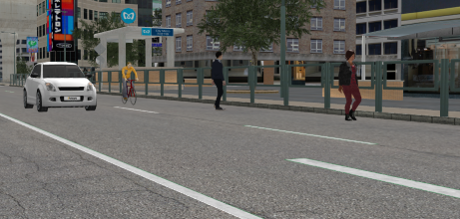

# Scaling Simulated Scenarios

The enlargement of the simulated scenarios was facilitated through the development of several Python scripts, designed to streamline the process. 

- [PrepareLidarData.py](../../Python_scripts/PrepareLidarData.py) undertakes the task of reorganization and renaming. It is worth mentioning that labels without corresponding objects within the camera’s field of view, known as empty labels, and their respective point clouds are disregarded during this process.

- [RunSequenceScripts.py](../../Python_scripts/RunSequenceScripts.py) automates the execution of a sequence of scripts. Upon scenario selection, this script ensures all components are prepared for use.

- [CollectData.py](../../Python_scripts/CollectData.py) collects point cloud data and labels from a multitude of source folders, transferring them to a unified destination folder. This transfer grants the data unique identifiers and sets the stage for the establishment of the 'Training' and 'Evaluation' databases.

- [visualize_utils.py](../../Python_scripts/visualize_utils.py) is employed extensively in this study for the purpose of visualizing point clouds and bounding boxes. This script was sourced from [OpenPCDet](https://github.com/open-mmlab/OpenPCDet).

The CarMaker Co-simulation Library deployed for this research provided 46 unique car assets, each representing distinct car models. However, these car assets comprise 15 distinct size variations, as some merely represent different color variations of the same model, as detailed in [ExtractInstanceDimensions.py](../../Python_scripts/ExtractInstanceDimensions.py) 

The library incorporates two pedestrian assets (male and female) and one cyclist asset. These assets can be configured as either dynamic or stationary entities.

Illustration of the diverse assets available in the CarMaker Co-simulation Library

<figure>
  
  <figcaption>Figure 1: Illustration of the diverse assets available in the CarMaker Co-simulation Library.</figcaption>
</figure>

In this research, a *scenario* designates a particular sequence of events or driving situation being simulated. *Environments*, conversely, refer to the virtual contexts within which these vehicle simulations occur, supplying the necessary physical conditions for the simulation.

For validation data collection, 31 unique scenarios across 3 unique environments were employed, yielding a total of 4,464 generated frames. However, only 3,617 of these frames contained objects within the field of view and were hence deemed suitable for further analysis.

For training, 66 unique scenarios across 8 unique environments were utilized, resulting in the generation of 9,872 frames, of which 5,981 frames captured objects within the field of view successfully.
