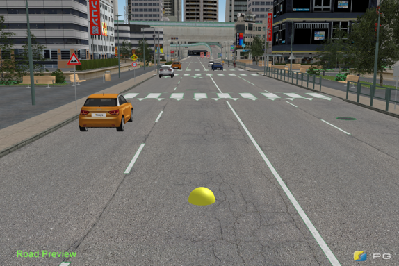
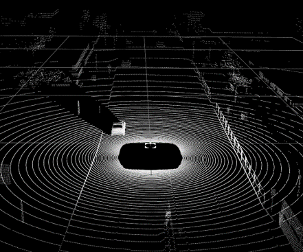
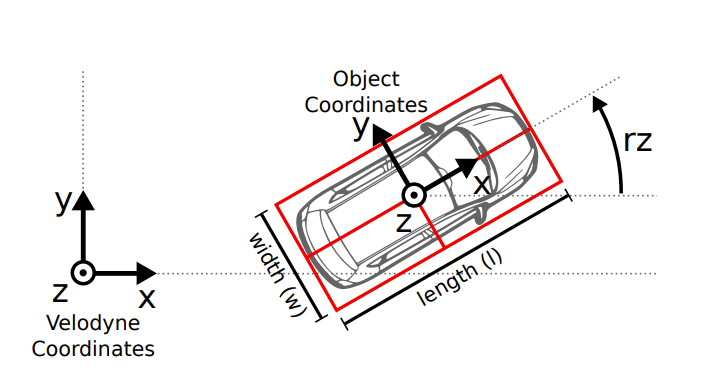

# Processing

The last stage of the data generation pipeline is to handle the output point cloud data to generate the ground truth labels needed for neural network training.

<figure>
  
  <figcaption>Figure 1.a: 3D Road Preview of a sample scenario. Courtesy of <a href="https://ipg-automotive.com/en/products-solutions/software/carmaker/">IPG Automotive</a>.</figcaption>
</figure>

<figure>
  
  <figcaption>Figure 1.b: Generated point cloud visualization for the corresponding scene. </figcaption>
</figure>

Figure 1.a shows a simulated scenario, created using the Ansys AVxcelerate CarMaker Co-Simulation. Figure 1.b provides a visual representation of the point cloud output from this scene.

After obtaining our point clouds, the next goal is to generate labels. But first, the objective should be defined.

## Processing objective

A main goal of this research is to get accurate ground truth 3D bounding boxes for detected traffic participants within a given scenario — namely, ’Car’, ’Cyclist’, and ’Pedestrian’.

The phrase ’ground truth’ refers to the absolute truth that the machine learning model’s predictions are compared against. These ground truth boxes are important for supervised learning, serving as training labels that guide the learning of a machine learning model. During its training phase, the model undergoes multiple updates with the goal to minimize the difference between its predictions and the ground truth.

When the model’s training is complete, it is important to test its performance on new data. In this step, the model’s predictions are compared with ground truth boxes, and the calculated metrics are used to evaluate the model’s performance.

As mentioned in [Lang et al.](https://arxiv.org/abs/1812.05784), ground truth boxes are used to calculate the loss function during training. They, along with the anchors, are described by a seven-dimensional vector that includes the 3D bounding boxes’ center point coordinates (x, y, z), dimensions (width - w, length - l, height - h), and rotation angle (yaw angle - θ).

The process of calculating localization regression residuals involves measuring the differences between the predicted (anchors) and the true (ground truth) bounding boxes for the related objects, as described in [Lang et al.](https://arxiv.org/abs/1812.05784). The total difference is used to calculate the localization loss, a part of the overall loss function used to train the network. This loss represents how far the model’s predictions are from the ground truth, with the goal being to minimize this difference during the training process.

In the study by [Geiger et al.](https://www.cvlibs.net/publications/Geiger2013IJRR.pdf), 3D bounding box annotations are provided for each moving object within the camera’s field of view, represented in LiDAR coordinates. The identified classes include ’Car’, ’Van’, ’Truck’, ’Pedestrian’, ’Person_sitting’, ’Cyclist’, ’Tram’, and ’Misc’ (e.g., Trailers, Segways). Each object is assigned a class and its 3D size (height, width, length), and each frame offers the object’s 3D translation and rotation, as displayed in Figure 2. It is worth noting that only the yaw angle is provided, with the other two angles (pitch and roll) approximated to be nearly zero [Geiger et al.](https://www.cvlibs.net/publications/Geiger2013IJRR.pdf).

<figure>
  
  <figcaption>Figure 2: Illustration of the coordinate system for annotated 3D bounding boxes in relation to the coordinate system of the 3D Velodyne laser scanner. Courtesy of <a href="https://www.cvlibs.net/publications/Geiger2013IJRR.pdf)">Geiger et al.</a>.</figcaption>
</figure>

In conclusion, the main purpose here is to generate 3D bounding boxes for traffic objects within a frame. As a result, a ground truth 3D bounding box is defined by the following parameters:

- x: x center
- y: y center
- z: z center
- w: width
- l: length
- h: height
- θ: yaw angle

Subsequent to this, there is a requirement to transform these ground truth 3D bounding boxes into the KITTI label format.