# Processing

The last stage of the data generation pipeline is to handle the output point cloud data to generate the ground truth labels needed for neural network training.

<figure>
  
  <figcaption>Figure 1.a: 3D Road Preview of a sample scenario. Courtesy of <a href="https://ipg-automotive.com/en/products-solutions/software/carmaker/">IPG Automotive</a>.</figcaption>
</figure>

<figure>
  
  <figcaption>Figure 1.b: Generated point cloud visualization for the corresponding scene.</figcaption>
</figure>


Figure 1.a shows a simulated scenario, created using the Ansys AVxcelerate CarMaker Co-Simulation. Figure 1.b provides a visual representation of the point cloud output from this scene.

After obtaining our point clouds, the next goal is to generate labels. But first, the objective should be defined.

## Processing objective

A main goal of this research is to get accurate ground truth 3D bounding boxes for detected traffic participants within a given scenario — namely, ’Car’, ’Cyclist’, and ’Pedestrian’.

The phrase ’ground truth’ refers to the absolute truth that the machine learning model’s predictions are compared against. These ground truth boxes are important for supervised learning, serving as training labels that guide the learning of a machine learning model. During its training phase, the model undergoes multiple updates with the goal to minimize the difference between its predictions and the ground truth.

When the model’s training is complete, it is important to test its performance on new data. In this step, the model’s predictions are compared with ground truth boxes, and the calculated metrics are used to evaluate the model’s performance.


As mentioned in [Lang et al.](https://arxiv.org/abs/1812.05784), ground truth boxes are used to calculate the loss function during training. They, along with the anchors, are described by a seven-dimensional vector that includes the 3D bounding boxes’ center point coordinates (x, y, z), dimensions (width - w, length - l, height - h), and rotation angle (yaw angle - θ).

The process of calculating localization regression residuals involves measuring the differences between the predicted (anchors) and the true (ground truth) bounding boxes for the related objects, as described in [Lang et al.](https://arxiv.org/abs/1812.05784). The total difference is used to calculate the localization loss, a part of the overall loss function used to train the network. This loss represents how far the model’s predictions are from the ground truth, with the goal being to minimize this difference during the training process.

In the study by [Geiger et al.](https://www.cvlibs.net/publications/Geiger2013IJRR.pdf), 3D bounding box annotations are provided for each moving object within the camera’s field of view, represented in LiDAR coordinates. The identified classes include ’Car’, ’Van’, ’Truck’, ’Pedestrian’, ’Person_sitting’, ’Cyclist’, ’Tram’, and ’Misc’ (e.g., Trailers, Segways). Each object is assigned a class and its 3D size (height, width, length), and each frame offers the object’s 3D translation and rotation, as displayed in Figure 2. It is worth noting that only the yaw angle is provided, with the other two angles (pitch and roll) approximated to be nearly zero [Geiger et al.](https://www.cvlibs.net/publications/Geiger2013IJRR.pdf).

<figure>
  
  <figcaption>Figure 2: Illustration of the coordinate system for annotated 3D bounding boxes in relation to the coordinate system of the 3D Velodyne laser scanner. Courtesy of <a href="https://www.cvlibs.net/publications/Geiger2013IJRR.pdf)">Geiger et al.</a>.</figcaption>
</figure>


In conclusion, the main purpose here is to generate 3D bounding boxes for traffic objects within a frame. As a result, a ground truth 3D bounding box is defined by the following parameters:

- x: x center
- y: y center
- z: z center
- w: width
- l: length
- h: height
- θ: yaw angle

Subsequent to this, there is a requirement to transform these ground truth 3D bounding boxes into the KITTI label format.


## Challenges

Calculating 3D bounding boxes brings with it a set of challenges. These can be divided into two categories.

### Deriving 3D Bounding Boxes from Point Cloud Data

The task of deriving 3D bounding boxes from point cloud data, even when the points corresponding to a particular object are known, is considerably difficult. This is due to several inherent traits of point cloud data and the nature of three-dimensional objects.

1. **Occlusions**: These occur when certain parts of an object are blocked or hidden by other entities within the scene, leading to an incomplete representation in the point cloud data.

2. **Variations in Point Density**: Inconsistencies often exist in the density of points throughout the structure of an object in point cloud data. These irregularities cause unequal representations of the object, thereby making the exact computation of 3D bounding boxes more difficult. Areas with lower point density, which may contain crucial structural features, add to the challenge.

3. **Orientation Determination**: Figuring out the correct orientation of the bounding box can be challenging. This is particularly difficult for three-dimensional objects that lack a clear ’up’ direction or where the primary axis is not clearly visible in the point cloud data.

4. **Sparse Distribution of Point Clouds**: The point cloud data corresponding to each object are often sparsely distributed, adding to the difficulty in accurately determining bounding boxes.

To better understand these challenges, consider the following example:


<figure>
  
  <figcaption>Figure 3.a: A sample synthetic point cloud; the yellow square indicates the traffic object of interest.</figcaption>
</figure>

<figure>
  
  <figcaption>Figure 3.b: Detailed view of the traffic object of interest in Figure 3.a.</figcaption>
</figure>


<figure>
  
  <figcaption>Figure 4.a: A sample synthetic point cloud; the yellow square indicates the traffic object of interest.</figcaption>
</figure>

<figure>
  
  <figcaption>Figure 4.b: Detailed view of the traffic object of interest in Figure 4.a.</figcaption>
</figure>


Figure 3 and Figure 4 demonstrate two distinct car objects within the same scene. For the example given in Figure 3, the computation of the bounding box appears achievable as the object is unoccluded and the point density is relatively high. By visually inspecting the object, it can be identified as a car, and a rectangular bounding box could theoretically be fitted to determine its orientation and dimensions.

Contrarily, consider the case presented in Figure 4. Assuming that the object’s point cloud is successfully extracted from the scene, determining the bounding box would be extremely difficult with the limited points available. To mitigate this issue, the Object Sensor in CarMaker is used. This sensor is capable of detecting objects and recording the relative position and orientation of these objects through Output quantities thereby aiding in overcoming these challenges.


### Field of View Calculation and Label Conversion

This research encountered several challenges related to the use and manipulation of the KITTI data set.

Firstly, in the KITTI data set, objects are labeled within the field of view of a reference camera. This created a problem in the simulation setup, where no camera was present. The absence of a camera made the computation of the field of view impossible.

Secondly, the conversion of 3D bounding boxes to the KITTI label format was necessary. This was needed to make use of existing resources made for KITTI, like neural network models trained on KITTI data. Also, using the KITTI format would make it easier to compare results with other KITTI-based research. Using this common format would also help in combining real and synthetic data sets, reducing possible data formatting issues that could affect test results.

To address these issues, the calibration parameters used for conversions from LiDAR coordinates to camera coordinates and onto the camera image plane were explored. Upon observing minimal variations in these parameters, a constant calibration matrix was assumed. This assumption is regarded as valid since the relative pose and orientation of the sensors remain unchanged throughout the data generation process. In this particular setup, the Velodyne LiDAR sensor and the hypothetical camera maintain their relative positions during the entire simulation.

A set of constant calibration parameters was subsequently implemented for each synthetic frame, borrowing from the parameters of a real frame from the KITTI data set. These parameters include:

1. **P<sup>(2)</sup><sub>rect</sub>**: The projection matrix post-rectification for camera 2 (the left color camera). This matrix transforms 3D points in the rectified camera coordinate system to 2D points in the image plane. It is a matrix of size 3 × 4.

2. **R<sup>(0)</sup><sub>rect</sub>**: The rectifying rotation matrix. This matrix aligns the 3D points in the camera coordinate system with the axes of the rectified coordinate system. It is a matrix of size 3 × 3.

3. **T<sup>cam</sup><sub>velo</sub>**: The transformation matrix, which converts 3D points from the LiDAR (Velodyne) coordinate system to the camera coordinate system. The first 3x3 segment is the rotation matrix, and the last column represents the translation vector. It is a matrix of size 3 × 4.

4. **image size**: The dimensions of the camera-generated image in pixels. This 1 × 2 matrix has the height of the image (375 pixels) as the first element and the width of the image (1242 pixels) as the second element.

Employing this methodology allowed for the calculation and filtering of the field of view prior to creating the 3D bounding boxes and converting these boxes into the KITTI label format. This approach ensured the preservation of the KITTI data set’s integrity and structure while supplementing synthetic data.

The calibration parameters utilized in this study are as follows:

1. :
<figure>
  
</figure>

2. :
<figure>
  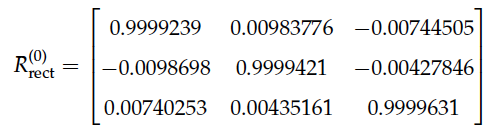
</figure>

3. :
<figure>
  
</figure>

4. :
<figure>
  
</figure>


The calibration parameters are foundational to the process of projecting 3D points from the Velodyne’s LiDAR coordinate system onto the 2D image plane of the camera.

A detailed walkthrough of the transformation process is provided below.

For a 3D point in the LiDAR coordinate system in homogeneous coordinates, denoted as `p_lidar = [X, Y, Z, 1]^T`, the conversion process includes three essential steps:

1. **Transform from Velodyne to Camera Coordinates:** Use the Velodyne-to-camera (`T_velo^cam`) calibration matrix to transform from the LiDAR to the camera coordinate system:
    ```
    p_cam = T_velo^cam × p_lidar
    ```
2. **Rectify the Camera Coordinates:** Apply the rectification rotation matrix `R_rect^(0)` to align the coordinates:
    ```
    p_rect = R_rect^(0) × p_cam
    ```
3. **Project to 2D:** Employ the rectified projection matrix `P_rect^(2)` to convert the 3D point from the rectified camera coordinate system to the 2D image plane of the camera:
    ```
    p_2D = P_rect^(2) × p_rect
    ```
    The resulting `P_2D` will be in homogeneous coordinates. To translate this to Cartesian coordinates, normalize the x and y values by the third coordinate:
    ```
    x = p_2D[0]/p_2D[2]
    y = p_2D[1]/p_2D[2]
    ```

The final x and y coordinates align with the 2D point on the image plane originating from the 3D point in the LiDAR coordinate system. These calibration parameters establish the foundation for enabling the conversion from LiDAR to camera coordinates, subsequently facilitating projection onto the image plane. This allows for the filtering of the field of view prior to the creation of 3D bounding boxes.

As highlighted in the objectives, the goal is to convert the 3D bounding boxes into the KITTI label format. However, to comprehend the potential benefits of this conversion, a brief overview of the KITTI labels is warranted.

The labels for KITTI's object detection data set are stored within text files, with each line representing an individual object present within the scene. Each point cloud frame corresponds to a specific text file. The fields of each line are as follows:

- **type:** Object class ('Car', 'Van', 'Truck', 'Pedestrian', 'Person_sitting', 'Cyclist', 'Tram', 'Misc', or 'DontCare').
- **truncated:** Float (0-1), extent of the object outside image boundaries (0 = fully visible, 1 = invisible).
- **occluded:** Integer (0, 1, 2, or 3), degree of object occlusion (0 = fully visible, 1 = partly occluded, 2 = largely occluded, 3 = unknown).
- **alpha:** Observation angle of object, ranging from -π to π.
- **bbox:** Four values defining 2D bounding box in image (x and y of top-left corner, x and y of bottom-right corner).
- **dimensions:** Three values (height, width, length), object dimensions in camera coordinates (meters).
- **location:** Three values (x,y,z), 3D location of object in camera coordinates (meters).
- **rotation_y:** Object rotation around y-axis in camera coordinates, ranging from -π to π.

While the computation of all label fields except for 'occluded' was accomplished, the computation of this field is left as a valuable target for future work.

## Processing Steps

### Deletion of Identical Point Clouds

We noticed some temporally successive point cloud outputs were identical, likely due to a bug in the AVX software. To ensure dataset integrity, these duplications had to be removed. This task was automated using a Python script named [IdenticalPointCloudDeletion.py](../Python_scripts/IdenticalPointCloudDeletion.py).

### Data Transformation

This phase focuses on aligning the original AVX environment’s coordinate system with that of the KITTI Velodyne LiDAR’s coordinate system. 

In the AVX environment the axes are defined as follows:

- **Z-axis:** the front direction
- **X-axis:** the left direction
- **Y-axis:** to the upward direction

The KITTI Velodyne LiDAR, however, operates on a different coordinate system. To align the two systems, a transformation is applied. This process is automated using [PointCloudTxtToNpyConverter.py](../Python_scripts/PointCloudTxtToNpyConverter.py). The transformed data, now adhering to the KITTI Velodyne LiDAR’s coordinate system, is saved as Numpy array files.

### Conversion of JSON Files to Text

An essential preprocessing step involves converting the LiDAR contribution dictionary from the JSON format to a more interpretable structure. This transformation aims to improve data readability by shifting the information into a text file format. [JsonToTxtConverter.py](../Python_scripts/JsonToTxtConverter.py) enables this conversion process.


## Extraction of Traffic Object Dimensions

In the analysis, unique instances from the contribution dictionary are considered. Each instance corresponds to traffic object names. For every unique instance, the associated dimensions are noted down in a text file, as shown in the table:

| Object | Length | Width | Height |
|--------|--------|-------|--------|
| CAR1   | 3.954  | 1.774 | 1.474  |
| CAR2   | 4.542  | 2.050 | 1.710  |
| CAR3   | 4.077  | 1.783 | 1.662  |
| CAR4   | 3.653  | 1.679 | 1.506  |
| CAR5   | 4.990  | 2.139 | 1.480  |
| BIC1   | 1.600  | 0.600 | 1.580  |
| PED1   | 0.410  | 0.600 | 1.664  |
| PED2   | 0.373  | 0.600 | 1.781  |

These dimensions are derived from a manually created list that includes dimensions for different models, covering all dimensions for the AVX traffic object assets. The completed list can be accessed in [ExtractInstanceDimensions.py](../Python_scripts/ExtractInstanceDimensions.py).

[ExtractInstanceDimensions.py](../Python_scripts/ExtractInstanceDimensions.py) aids in performing this task. A sample output is presented in the table.

## Mapping Instance Names to Entity Identifiers

This step involves mapping the instance names from the table to their respective EntityIDs from the contribution dictionary. The result is a file documenting each instance name (traffic objects), with a list of its corresponding EntityIDs. The resulting data can be viewed:

1. CAR1: [’136’, ’137’, ’138’, ’139’, ’140’, ’141’, ’142’, ’143’, ’144’, ’145’, ’146’, ’147’, ’148’, ’149’]
2. CAR2: [’151’, ’152’, ’153’, ’154’, ’155’, ’156’, ’157’, ’158’, ’159’, ’160’, ’161’, ’162’, ’164’, ’166’, ’169’]
3. CAR3: [’171’, ’172’, ’173’, ’174’, ’175’, ’176’, ’177’, ’178’, ’179’, ’180’, ’181’, ’182’, ’183’, ’184’, ’185’]
4. CAR4: [’187’, ’188’, ’189’, ’190’, ’191’, ’192’, ’193’, ’194’, ’195’, ’196’, ’197’, ’199’, ’200’]
5. CAR5: [’202’, ’203’, ’204’, ’205’, ’206’, ’207’, ’208’, ’209’, ’210’, ’211’, ’212’, ’213’, ’214’, ’215’, ’216’, ’217’, ’218’]
6. BIC1: [’220’, ’221’]
7. PED1: [’223’, ’224’, ’225’, ’226’, ’227’, ’228’, ’229’]
8. PED2: [’231’, ’232’, ’233’, ’234’, ’235’, ’236’, ’237’]

[GenerateInstanceEntityIDMapping.py](../Python_scripts/GenerateInstanceEntityIDMapping.py) was developed to perform this task. 

## Label Generation

Label generation is a critical step when working with LiDAR point cloud data. [LidarPointCloudLabelGenerator.py](../Python_scripts/LidarPointCloudLabelGenerator.py) performs this task, processing LiDAR point cloud data directories and generating a corresponding set of labels that adhere to the KITTI label format. Each label is then stored in a distinct file that corresponds to a specific point cloud.

The algorithm's implementation is complex and necessitates some discussion of its key features:

- The algorithm first filters out blank lines in the contribution file and then removes the associated points in the point cloud. This step effectively eliminates beams that did not interact with any elements in the scene, causing their absence from the point cloud.
  
- The point cloud is subsequently transformed from LiDAR coordinates to rectified camera coordinates using the parameters and equations. These rectified points are projected onto an image plane using the camera parameters. A subsequent check ensures these projected points remain within the image boundaries and that the points' depth remains non-negative.

- The algorithm then applies a specific range for point cloud filtration, defined as follows:
  - Point Cloud Range [m] = [xmin = 0, ymin = -39.68, zmin = -3, xmax = 69.12, ymax = 39.68, zmax = 1]
  This point cloud range is consistent with the parameters used for training and evaluating the network.
  
- The effect of field of view filtering on point clouds is demonstrated in Figure 5. Figure 5.a displays an initial state of a representative point cloud, while Figure 5.b shows the same point cloud after applying field of view filtering, visually highlighting the significant effect of this filtering method.

- The next step is the extraction of object point clouds for each traffic object using the EntityIDs. Let's consider 'CAR1' as an object of interest; its dimensions can be found in the table. This object's relative position and orientation, as recorded by CarMaker's Object Sensor. Note that there are ten separate object scans indicating a reading frequency of every 0.01 seconds.


<figure>
  
  <figcaption>Figure 5.a: Illustration of a sample point cloud.</figcaption>
</figure>

<figure>
  
  <figcaption>Figure 5.b: Illustration of a sample point cloud after the application of field of view filtering.</figcaption>
</figure>

Each object is characterized by six distinct parameters: ds.x, ds.y, ds.z, rzyx.x, rzyx.y, and rzyx.z. However, rzyx.x and rzyx.y are disregarded in line with KITTI labels, which only consider the yaw angle, thus represented by rzyx.z. The bounding box’s center coordinates are determined by shifting ds.x and ds.y along the object’s orientation direction (i.e., rzyx.z) by half the object’s length. This shift is needed because the reference point of the traffic object is positioned on the rear-plane.

With these parameters, 3D bounding boxes can now be defined by their center point, extent, and yaw angle. However, with ten bounding box candidates existing, an iterative process is employed. For each candidate center and yaw angle, an oriented bounding box is constructed at the center with the given extents and yaw angle. Then, the number of points from the object point cloud falling within each oriented bounding box candidate is computed. The oriented bounding box enclosing the maximum number of points is selected.

<figure>
  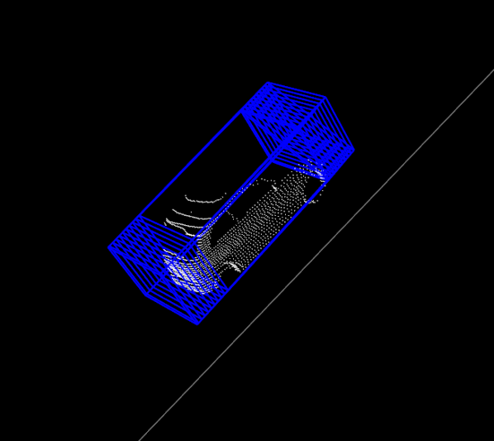
  <figcaption>Figure 6: Depiction of 3D bounding box candidates associated with a car.</figcaption>
</figure>

Figure 6 highlights the importance of considering multiple candidate oriented bounding boxes during the selection process. This figure visually demonstrates the 3D bounding box candidates corresponding to a traffic object –— in this case, a car. This examination ensures the most encompassing and representative 3D bounding box is selected for each traffic object.

To improve the representation of object dimensions, particularly for the 'Pedestrian' and 'Cyclist' categories, it is vital to refine the initial oriented bounding box, which is derived from CarMaker’s provided positions. Given the inherent structure and physical attributes of 'Pedestrian' and 'Cyclist', the corresponding point clouds can appear in irregular and scattered patterns, potentially resulting in a mismatch between the initial bounding box and the actual object point cloud. Therefore, it is necessary to verify the dimensional compatibility of the bounding box and the object point cloud along each axis.

If the bounding box fails to encapsulate the object point cloud on any axis, the box must be expanded to match the object point cloud’s dimension on that axis. This expansion requires a recomputation of the box’s center. However, adjustments might still be necessary, even if an expansion is not required. Such cases typically occur when the point cloud lacks symmetry or when the distribution of points is uneven. Under these circumstances, the xy-plane center of the bounding box may not align with the point cloud’s center. This necessitates realigning the bounding box’s center in the xy-plane with the point cloud’s center, while maintaining the same z-coordinate.

Figure 7 illustrates the critical nature of these adjustments and expansions. Figure 7.a shows a T-shaped pedestrian spreading their arms wide. The inner bounding box, derived from CarMaker, does not cover all points of the object, hence requiring expansion. Figure 7.b displays a cyclist. Here, the left bounding box (initial one) suggests an asymmetric object distribution, which is rectified in the right box (modified one).

<figure>
  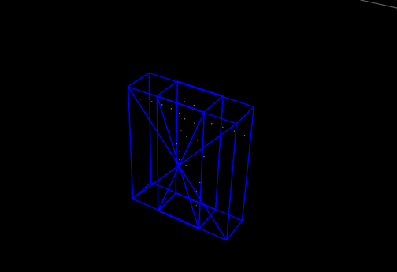
  <figcaption>Figure 7.a: The inner box shows the bounding box before modification, the outer box shows the after expansion.</figcaption>
</figure>

<figure>
  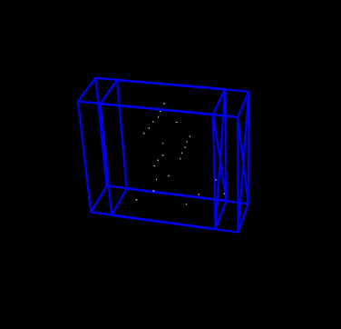
  <figcaption>Figure 7.b: The left box shows the bounding box before modification, the right box shows after adjustment.</figcaption>
</figure>


These modifications ensure that the bounding box accurately encapsulates the spatial extent of the object in the LiDAR point cloud, thus enhancing object detection performance.

The 'truncated' parameter is an essential part of the KITTI labels. This floating-point value, which ranges from 0 (non-truncated) to 1 (truncated), indicates the object’s visibility extent, with truncation correlating to the object’s deviation from image boundaries.

This concept is visually exemplified in Figures 8.a and 8.b. Figure 8.a portrays a traffic object, 'Car', represented in a raw point cloud, while Figure 8.b displays the same object post the application of field of view filtering.


<figure>
  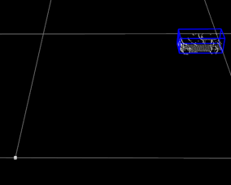
  <figcaption>Figure 8.a: Raw object point cloud and its corresponding bounding box.</figcaption>
</figure>

<figure>
  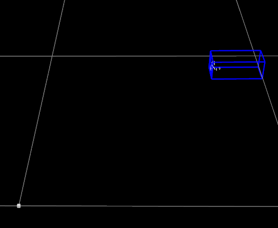
  <figcaption>Figure 8.b: Filtered version of Figure 8.a.</figcaption>
</figure>

<figure>
  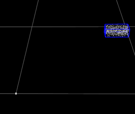
  <figcaption>Figure 8.c: Uniformly distributed hypothetical point cloud generated within the bounding box.</figcaption>
</figure>

<figure>
  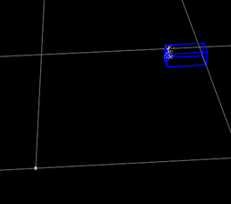
  <figcaption>Figure 8.d: Filtered version of Figure 8.c.</figcaption>
</figure>


The necessity to compute the truncation value becomes evident upon noticing a discrepancy in the number of points enclosed within the bounding boxes in Figures 8.a and 8.b. When such a need arises, a uniformly distributed hypothetical point cloud is generated within the bounding box, as shown in Figure 8.c. Following this, the hypothetical point cloud undergoes filtering using the identical calibration parameters. The outcome, represented in Figure 8.d, is the filtered version of the hypothetical point cloud.

The truncation value is subsequently derived as one minus the ratio of the number of points in the filtered hypothetical point cloud to the number in the original hypothetical point cloud. Consequently, for the example depicted in Figure 8, the computed truncation value is 0.9.


Throughout this study, observations suggest that modifying the z-coordinate (height) of the established bounding boxes can lead to a better match with the genuine 3D object shape present in the point cloud data.

For cars, the modification involved decreasing the z-coordinate by a value of 0.08m. This downward shift aimed to correct for an inherent offset present in the synthetic data generated by CarMaker, which resulted in the initial bounding boxes being slightly elevated above the road surface.

Conversely, for 'Pedestrian' and 'Cyclist' objects, the bounding boxes were adjusted upward by increasing the z-coordinate by 0.02m. This modification was intended to exclude road surface points from the bounding boxes, thereby improving the accuracy of object representation.

These adjustments, while based on observed patterns, cater specifically to the unique characteristics of the synthetic data set employed in this study. The adjustment values were chosen through a process of repeated visual inspections of the data, and their application may not be universally suitable for other data sets or simulation scenarios.

In the concluding stage of this process, the oriented bounding box - characterized by its center, extent, and yaw angle - along with the truncation value, is converted into a label string following the KITTI label format, as referenced in section 3.4.2.2. This conversion was enabled through the use of the calibration matrix and the associated transformations discussed in the same section.

Nonetheless, a lingering challenge remains: calculating the 'occluded' field in the KITTI label. Due to current project limitations, this aspect has not been addressed, resulting in all objects being labeled as 'fully visible'. This opens up a potential avenue for future refinement to further boost the representation in this synthetic data set.

The label generation procedure concludes with the creation of labels for a synthetic point cloud. The resulting labels, formatted in KITTI style, are displayed in following table:

| Type | Tr. | Occ. | Alpha | left | top | right | bottom | height | width | length | x | y | z | Rot. Y |
| --- | --- | --- | --- | --- | --- | --- | --- | --- | --- | --- | --- | --- | --- | --- |
| Car | 0.00 | 0 | -1.14 | 63.86 | 185.86 | 397.10 | 361.11 | 1.47 | 1.77 | 3.95 | -3.99 | 1.66 | 8.34 | -1.57 |
| Car | 0.00 | 0 | -1.49 | 532.63 | 178.93 | 567.90 | 205.60 | 1.71 | 2.05 | 4.54 | -4.08 | 2.15 | 49.57 | -1.57 |

In this context, 'Tr.' refers to 'truncated', 'Occ.' to 'occluded', and 'Rot. Y' signifies 'rotation_y'. This table presents the labels for two cars detected in the synthetic point cloud visualized in Figure 1.b.


To provide a more accessible understanding, visualizations of labeled bounding boxes on both real and synthetic data are displayed, in addition to raw and filtered data. 

Figures 3.9 and 3.10 demonstrate these visualizations. Figure 3.9 displays the labeled bounding boxes, represented in blue, on a raw real point cloud from the KITTI data set, in conjunction with those on a raw synthetic point cloud. In a similar manner, Figure 3.10 exhibits the labeled bounding boxes on filtered versions of these point clouds, specifically focusing on the camera’s field of view.

<figure>
  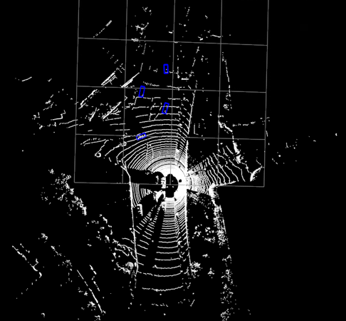
  <figcaption>Figure 9.a: Raw real point cloud from the KITTI data set, with labeled bounding boxes indicated in blue.</figcaption>
</figure>

<figure>
  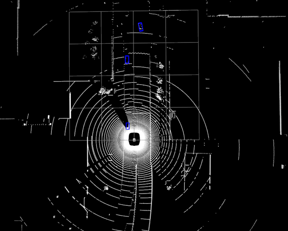
  <figcaption>Figure 9.b: Raw synthetic point cloud, with labeled bounding boxes indicated in blue.</figcaption>
</figure>

<figure>
  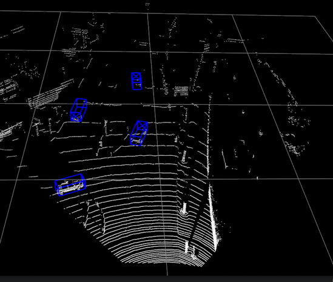
  <figcaption>Figure 10.a: Filtered real point cloud from the KITTI data set, with labeled bounding boxes indicated in blue.</figcaption>
</figure>

<figure>
  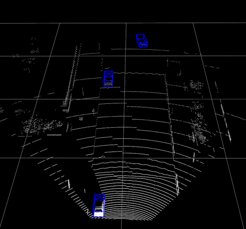
  <figcaption>Figure 10.b: Filtered synthetic point cloud, with labeled bounding boxes indicated in blue.</figcaption>
</figure>


Upon examination of these figures, certain differences between synthetic and real point clouds become apparent. Synthetic point clouds, as generated by AVX, possess lower noise levels, owing to their derivation from idealized models. Moreover, they appear more complete, a consequence of being produced from comprehensive 3D scene models.

Conversely, real point clouds are inherently imperfect and tend to include gaps or missing data, a result of occlusions in the real world environment. This distinction is particularly noticeable in Figures 9 and 10.

