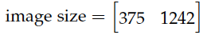

# Processing

The last stage of the data generation pipeline is to handle the output point cloud data to generate the ground truth labels needed for neural network training.

<figure>
  
  <figcaption>Figure 1.a: 3D Road Preview of a sample scenario. Courtesy of <a href="https://ipg-automotive.com/en/products-solutions/software/carmaker/">IPG Automotive</a>.</figcaption>
</figure>

<figure>
  
  <figcaption>Figure 1.b: Generated point cloud visualization for the corresponding scene.</figcaption>
</figure>

Figure 1.a shows a simulated scenario, created using the Ansys AVxcelerate CarMaker Co-Simulation. Figure 1.b provides a visual representation of the point cloud output from this scene.

After obtaining our point clouds, the next goal is to generate labels. But first, the objective should be defined.

## Processing objective

A main goal of this research is to get accurate ground truth 3D bounding boxes for detected traffic participants within a given scenario — namely, ’Car’, ’Cyclist’, and ’Pedestrian’.

The phrase ’ground truth’ refers to the absolute truth that the machine learning model’s predictions are compared against. These ground truth boxes are important for supervised learning, serving as training labels that guide the learning of a machine learning model. During its training phase, the model undergoes multiple updates with the goal to minimize the difference between its predictions and the ground truth.

When the model’s training is complete, it is important to test its performance on new data. In this step, the model’s predictions are compared with ground truth boxes, and the calculated metrics are used to evaluate the model’s performance.

As mentioned in [Lang et al.](https://arxiv.org/abs/1812.05784), ground truth boxes are used to calculate the loss function during training. They, along with the anchors, are described by a seven-dimensional vector that includes the 3D bounding boxes’ center point coordinates (x, y, z), dimensions (width - w, length - l, height - h), and rotation angle (yaw angle - θ).

The process of calculating localization regression residuals involves measuring the differences between the predicted (anchors) and the true (ground truth) bounding boxes for the related objects, as described in [Lang et al.](https://arxiv.org/abs/1812.05784). The total difference is used to calculate the localization loss, a part of the overall loss function used to train the network. This loss represents how far the model’s predictions are from the ground truth, with the goal being to minimize this difference during the training process.

In the study by [Geiger et al.](https://www.cvlibs.net/publications/Geiger2013IJRR.pdf), 3D bounding box annotations are provided for each moving object within the camera’s field of view, represented in LiDAR coordinates. The identified classes include ’Car’, ’Van’, ’Truck’, ’Pedestrian’, ’Person_sitting’, ’Cyclist’, ’Tram’, and ’Misc’ (e.g., Trailers, Segways). Each object is assigned a class and its 3D size (height, width, length), and each frame offers the object’s 3D translation and rotation, as displayed in Figure 2. It is worth noting that only the yaw angle is provided, with the other two angles (pitch and roll) approximated to be nearly zero [Geiger et al.](https://www.cvlibs.net/publications/Geiger2013IJRR.pdf).

<figure>
  
  <figcaption>Figure 2: Illustration of the coordinate system for annotated 3D bounding boxes in relation to the coordinate system of the 3D Velodyne laser scanner. Courtesy of <a href="https://www.cvlibs.net/publications/Geiger2013IJRR.pdf)">Geiger et al.</a>.</figcaption>
</figure>

In conclusion, the main purpose here is to generate 3D bounding boxes for traffic objects within a frame. As a result, a ground truth 3D bounding box is defined by the following parameters:

- x: x center
- y: y center
- z: z center
- w: width
- l: length
- h: height
- θ: yaw angle

Subsequent to this, there is a requirement to transform these ground truth 3D bounding boxes into the KITTI label format.

## Challenges

Calculating 3D bounding boxes brings with it a set of challenges. These can be divided into two categories.

### Deriving 3D Bounding Boxes from Point Cloud Data

The task of deriving 3D bounding boxes from point cloud data, even when the points corresponding to a particular object are known, is considerably difficult. This is due to several inherent traits of point cloud data and the nature of three-dimensional objects.

1. **Occlusions**: These occur when certain parts of an object are blocked or hidden by other entities within the scene, leading to an incomplete representation in the point cloud data.

2. **Variations in Point Density**: Inconsistencies often exist in the density of points throughout the structure of an object in point cloud data. These irregularities cause unequal representations of the object, thereby making the exact computation of 3D bounding boxes more difficult. Areas with lower point density, which may contain crucial structural features, add to the challenge.

3. **Orientation Determination**: Figuring out the correct orientation of the bounding box can be challenging. This is particularly difficult for three-dimensional objects that lack a clear ’up’ direction or where the primary axis is not clearly visible in the point cloud data.

4. **Sparse Distribution of Point Clouds**: The point cloud data corresponding to each object are often sparsely distributed, adding to the difficulty in accurately determining bounding boxes.

To better understand these challenges, consider the following example:

<figure>
  
  <figcaption>Figure 3.a: A sample synthetic point cloud; the yellow square indicates the traffic object of interest.</figcaption>
</figure>

<figure>
  
  <figcaption>Figure 3.b: Detailed view of the traffic object of interest in Figure 3.a.</figcaption>
</figure>

<figure>
  
  <figcaption>Figure 4.a: A sample synthetic point cloud; the yellow square indicates the traffic object of interest.</figcaption>
</figure>

<figure>
  
  <figcaption>Figure 4.b: Detailed view of the traffic object of interest in Figure 4.a.</figcaption>
</figure>

Figure 3 and Figure 4 demonstrate two distinct car objects within the same scene. For the example given in Figure 3, the computation of the bounding box appears achievable as the object is unoccluded and the point density is relatively high. By visually inspecting the object, it can be identified as a car, and a rectangular bounding box could theoretically be fitted to determine its orientation and dimensions.

Contrarily, consider the case presented in Figure 4. Assuming that the object’s point cloud is successfully extracted from the scene, determining the bounding box would be extremely difficult with the limited points available. To mitigate this issue, the Object Sensor in CarMaker is used. This sensor is capable of detecting objects and recording the relative position and orientation of these objects through Output quantities thereby aiding in overcoming these challenges.

#### 3.4.2.2. Field of View Calculation and Label Conversion

This research encountered several challenges related to the use and manipulation of the KITTI data set.

Firstly, in the KITTI data set, objects are labeled within the field of view of a reference camera. This created a problem in the simulation setup, where no camera was present. The absence of a camera made the computation of the field of view impossible.

Secondly, the conversion of 3D bounding boxes to the KITTI label format was necessary. This was needed to make use of existing resources made for KITTI, like neural network models trained on KITTI data. Also, using the KITTI format would make it easier to compare results with other KITTI-based research. Using this common format would also help in combining real and synthetic data sets, reducing possible data formatting issues that could affect test results.

To address these issues, the calibration parameters used for conversions from LiDAR coordinates to camera coordinates and onto the camera image plane were explored. Upon observing minimal variations in these parameters, a constant calibration matrix was assumed. This assumption is regarded as valid since the relative pose and orientation of the sensors remain unchanged throughout the data generation process. In this particular setup, the Velodyne LiDAR sensor and the hypothetical camera maintain their relative positions during the entire simulation.

A set of constant calibration parameters was subsequently implemented for each synthetic frame, borrowing from the parameters of a real frame from the KITTI data set. These parameters include:

1. **P(2)rect**: The projection matrix post-rectification for camera 2 (the left color camera). This matrix transforms 3D points in the rectified camera coordinate system to 2D points in the image plane. It is a matrix of size 3 × 4.

2. **R(0)rect**: The rectifying rotation matrix. This matrix aligns the 3D points in the camera coordinate system with the axes of the rectified coordinate system. It is a matrix of size 3 × 3.

3. **Tcamvelo**: The transformation matrix, which converts 3D points from the LiDAR (Velodyne) coordinate system to the camera coordinate system. The first 3x3 segment is the rotation matrix, and the last column represents the translation vector. It is a matrix of size 3 × 4.

4. **image size**: The dimensions of the camera-generated image in pixels. This 1 × 2 matrix has the height of the image (375 pixels) as the first element and the width of the image (1242 pixels) as the second element.

Employing this methodology allowed for the calculation and filtering of the field of view prior to creating the 3D bounding boxes and converting these boxes into the KITTI label format. This approach ensured the preservation of the KITTI data set’s integrity and structure while supplementing synthetic data.

The calibration parameters utilized in this study are as follows:

1. :
<figure>
  
</figure>

2. :
<figure>
  
</figure>

3. :
<figure>
  
</figure>

4. :
<figure>
  
</figure>

The calibration parameters are foundational to the process of projecting 3D points from the Velodyne’s LiDAR coordinate system onto the 2D image plane of the camera.

