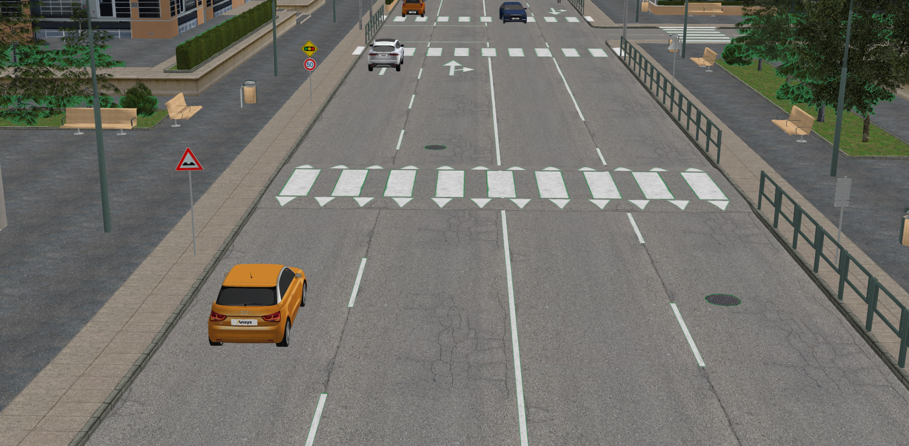
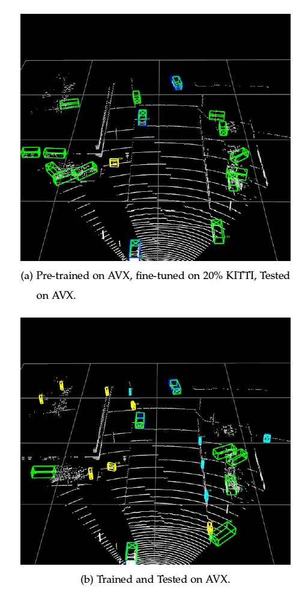
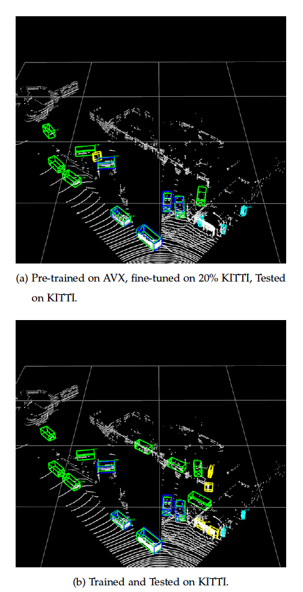

# Qualitative Analysis

The goal of this analysis is to provide an in-depth understanding of the model's performance and potential shortcomings. Two specific tests are discussed: detections from synthetic database and real database detections.

## Analysis on AVX test set

This section presents an investigation of a subset from the AVX test set. The networks under analysis include the AVX benchmark network and another network pre-trained on AVX and subsequently fine-tuned with 20% of the KITTI dataset.

Visual representations of detection results are available as video demonstrations assembled from screenshots at:  
- [Master Thesis Supplements repository](https://github.com/aydnzn/Master-Thesis-Supplements)

<figure>
  
  <figcaption>Synthetic scene from Co-simulation. Courtesy of <a href="https://ipg-automotive.com/en/products-solutions/software/carmaker/">IPG Automotive</a>.</figcaption>
</figure>

Two videos are provided for visualization. Both maintain a frame rate of 0.5 frames per second to enhance visualization:

1. [Video 1](https://github.com/aydnzn/Master-Thesis-Supplements/blob/main/video_1.mp4) corresponds to the network pre-trained on AVX and fine-tuned on 20% KITTI.
2. [Video 2](https://github.com/aydnzn/Master-Thesis-Supplements/blob/main/video_2.mp4) corresponds to the AVX benchmark network.

<figure>
  
  <figcaption>Figure 1: Color-coded detection results</figcaption>
</figure>

Upon examining the results, false positives are evident primarily due to the low confidence threshold. Despite this, all positive samples within the frames have been detected. The impact of data imbalance on detection results is evident where short traffic poles are incorrectly classified as pedestrians.

The AP_3D scores for the network trained and evaluated on AVX were reported as 81.27 for cars, 74.38 for pedestrians, and 90.99 for cyclists. On the other hand, for the network that was pre-trained on AVX and subsequently fine-tuned on 20% KITTI, the AP_3D scores on the AVX evaluation were 51.88 for cars, 0.02 for pedestrians, and 53.40 for cyclists.

## Analysis on KITTI test set

This section discusses an evaluation of a subset from the KITTI test set. Two networks are examined: the benchmark network trained on the KITTI dataset and another network pre-trained on the AVX dataset and fine-tuned with 20% of the KITTI dataset.

<figure>
  
  <figcaption>Real-world scene from KITTI dataset. Courtesy of <a href="https://www.cvlibs.net/publications/Geiger2013IJRR.pdf">Geiger et al.</a>.</figcaption>
</figure>

The corresponding videos for visualization are:
1. [Video 3](https://github.com/aydnzn/Master-Thesis-Supplements/blob/main/video_3.mp4) corresponds to the network pre-trained on AVX and fine-tuned on 20% KITTI.
2. [Video 4](https://github.com/aydnzn/Master-Thesis-Supplements/blob/main/video_4.mp4) corresponds to the KITTI benchmark network.

<figure>
  
  <figcaption>Figure 2: Color-coded detection results on KITTI</figcaption>
</figure>

Similar to the previous analysis, false positives are present due to the low confidence threshold. However, all labeled ground truths are successfully detected by both networks. The impact of 'DontCare' labels is also evident, as two parked cars far from the camera are detected but do not contribute to false positive calculations in the AP score computation.

The AP_3D scores for the network trained and evaluated on the KITTI dataset were 76.47 for cars, 48.42 for pedestrians, and 63.64 for cyclists. On the other hand, for the network pre-trained on AVX and fine-tuned on 20% KITTI, the AP_3D scores on the KITTI evaluation were 72.68 for cars, 40.91 for pedestrians, and 56.88 for cyclists.

Though valuable insights have been derived from this initial analysis, it should be viewed as a starting point for more comprehensive investigations. Manual comparison and examination of thousands of frames may not be practical, but they can guide potential future modifications and enhancements to the network.
