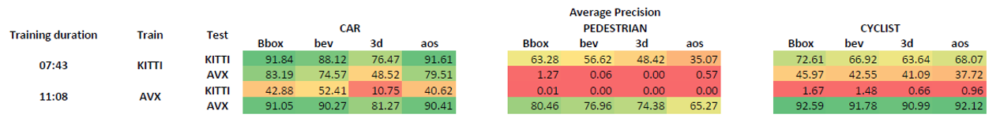

# Results from Experiment 1

<figure>
  
  <figcaption></figcaption>
</figure>

The table presents the AP performance results of the first experiment, which involved object detection tasks for vehicles (CAR), pedestrians (PEDESTRIAN), and cyclists (CYCLIST), using diverse data sets for training and testing -- the KITTI and AVX sets.

Four evaluation metrics are employed in this experiment: AP\_2D, AP\_3D, AP\_BEV, and AOS. In the table, these metrics are represented as **Bbox** for AP\_2D, **3d** for AP\_3D, **bev** for AP\_BEV, and **aos** for AOS. 

The 'Training duration' column represents the duration of the model's training phase, performed with a batch size of 2 and epoch size of 80. The 'Train' and 'Test' columns indicate the data sets employed for training and testing the model, respectively. The subsequent columns report the AP values for different evaluation metrics across the three object categories.

High scores are represented in green color, while low scores are indicated in red in the table.

Key findings:

- High AP values across all metrics and object categories when both training and testing on the KITTI dataset.
- Models trained on KITTI struggle when tested on synthetic AVX data, especially in complex tasks like pedestrian detection.
- Models trained on synthetic AVX data underperform when tested on real-world KITTI data, underscoring the need for strategic combinations of synthetic and real-world data.
- Exceptional performance when both training and testing on the AVX dataset.

Challenges encountered include pedestrian detection due to smaller image size and potential occlusion, as well as bias in object distribution across training sets. Performance disparities across different metrics point to the complexities of tasks evaluated by these metrics, especially AP_3D.

These findings highlight the importance of innovative training strategies that incorporate both real-world and synthetic data.
