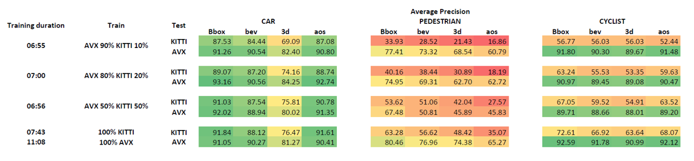

# Results from Experiment 2

<figure>
  
  <figcaption></figcaption>
</figure>

This section presents the effect of training the model using various ratios of synthetic and real-world data. The model's subsequent evaluation on both data sets yields results similar to those described in Experiment 1. The final two rows serve as benchmarks, reproducing the conditions of Experiment 1 wherein the model is trained and evaluated on identical data sets.

A distinct trend emerges across all object categories: the model's performance on the KITTI test set improves proportionally to the increase of KITTI data used during training. This suggests an increased ability of the model to handle the complexities of real-world scenarios as more real-world data is incorporated into the training set.

Here's a closer look at the results for each category:

## CAR

Despite varying proportions of real-world and synthetic data in the training set, the model's performance on the AVX test set remains consistent. This implies the model's robust capability in interpreting synthetic data and its resilience to the incorporation of increasing amounts of real-world data in the training set.

Importantly, the model performs competitively when trained on an equal mix of AVX and KITTI data. This suggests that a combination of synthetic and real-world data could yield results parallel to those obtained from training exclusively on either type of data, emphasizing the potential of synthetic data to augment real-world data.

These observations underscore the importance and potential of synthetic data, particularly in scenarios with limited real-world data.

## PEDESTRIAN

In the 'Pedestrian' category, the model's performance fluctuates significantly depending on the blend of synthetic and real-world data applied during training. The pedestrian detection scores persistently remain beneath both baselines, indicating substantial variations between the KITTI and AVX data sets concerning pedestrian representation.

This variation may be linked to the limitations in synthetic data's ability to reproduce the diversity in pedestrian appearances, movements, and environments, or potentially arise from differences in annotation standards between the two data sets.

## CYCLIST

In the 'Cyclist' category, consistent model performance is evident across the AVX test set, regardless of the proportion of synthetic and real-world data used during training. 

However, the AP values for 'Cyclist' detection on the KITTI test set consistently fall short when compared to those on the AVX test set across all training compositions. This discrepancy can be potentially attributed to the synthetic data's limited representation of cyclist diversity. This observation indicates the need for incorporating a wider variety of cyclist assets into the synthetic data set to better replicate the complexities and variations present in real-world scenarios.
