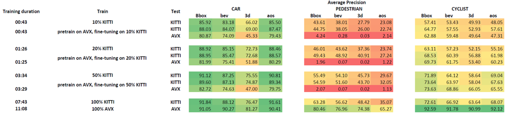

# Experiment 3: AVX Synthetic Data for Pre-training and Fine-tuning

This part contains resources and results from Experiment 3.

<figure>
  
  <figcaption></figcaption>
</figure>

The above table shows the model's performance across various training scenarios, both on the AVX and KITTI data sets. The final two rows in the table serve as a performance benchmark replicating conditions where the training and testing data sets are identical.

## Findings

- Fine-tuning an already pre-trained model on a specific data set capitalizes on the pre-trained model's learned features, potentially reducing the computational resources and time needed for training.
- The training scenarios represented by 10%, 20%, and 50% of the KITTI data set depict conditions of limited availability of real-world data. The evaluation metrics adopted for this analysis are consistent with those introduced in previous experiments.
- The hybrid approach of pre-training on synthetic AVX data and fine-tuning on real-world data from the KITTI data set can be beneficial, especially in scenarios with limited real-world data. However, it does not substitute for training on larger data sets.

## Category-specific Analysis

### CAR Category

The 'Car' category, when examined, displays a notable trend. The benefits of pre-training using synthetic AVX data become particularly apparent, especially when there is a shortage of real-world KITTI data.

### PEDESTRIAN Category

Within the 'Pedestrian' category, the results gathered via pre-training and subsequent fine-tuning on 10% or 20% of KITTI data, followed by evaluation on the KITTI test set, seem to fall short of the baseline metrics obtained with 100% KITTI data.

### CYCLIST Category

In the 'Cyclist' category, with a training set comprised of 10% KITTI data, the methodology involving pre-training on AVX data followed by fine-tuning on KITTI data results in superior AP values across the AP_2D, AP_BEV, AP_3D, and AOS metrics in comparison to the model trained solely on 10% KITTI data.

For more details, please refer to the [thesis](../../../aydin_uzun_ms_thesis.pdf).

