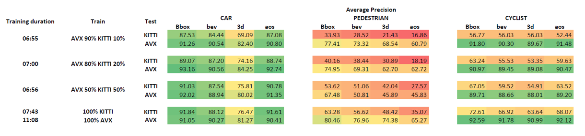

# Results

This repository contains the results and discussion of my master's thesis, broken down into these sections:

## Quantitative Results
### Experiment1
# Experiment 1 Results

<figure>
  
  <figcaption></figcaption>
</figure>

The table presents the AP performance of object detection tasks for vehicles (CAR), pedestrians (PEDESTRIAN), and cyclists (CYCLIST) using KITTI and AVX datasets.

Evaluation metrics used include AP_2D (Bbox), AP_3D (3d), AP_BEV (bev), and AOS (aos). 'Training duration' indicates the length of model training (batch size of 2, epoch size of 80). 'Train' and 'Test' columns denote datasets used for training and testing.

Key findings:

- High AP values for models trained and tested on the KITTI dataset.
- Models trained on KITTI underperform when tested on AVX data.
- Models trained on AVX data struggle on real-world KITTI data.
- Outstanding performance when training and testing on AVX dataset.

The results underscore the need for balanced combinations of synthetic and real-world data in model training.
For more details, see the [readme](./Quantitative/Experiment1/README.md)
### Experiment2

<figure>
  
  <figcaption></figcaption>
</figure>

- Model's KITTI performance improves with more KITTI data in training.
- CAR: Equal mix of AVX/KITTI yields good results.
- PEDESTRIAN: Performance fluctuates based on training data mix.
- CYCLIST: Consistent AVX performance, but lower KITTI scores suggest need for better cyclist representation in synthetic data.

For more details, see the [readme](./Quantitative/Experiment2/README.md)

### Experiment3
<figure>
  
  <figcaption></figcaption>
</figure>

- Pre-training on AVX followed by fine-tuning on KITTI is beneficial, especially with limited real-world data.
- **CAR**: Pre-training on AVX is highly beneficial with limited KITTI data.
- **PEDESTRIAN**: Pre-training plus fine-tuning on 10-20% KITTI data falls short of 100% KITTI training.
- **CYCLIST**: Pre-training on AVX plus fine-tuning on 10% KITTI outperforms 10% KITTI-only training.

For more details, see the [readme](./Quantitative/Experiment3/README.md)

### Pre-training and Training Duration Impact on 3D AP Scores Analysis

This repository investigates the impact of pre-training duration and training epochs on the AP_3D scores for 'Car' and 'Cyclist' categories. The scenarios in focus:

1. Training only on 10% of the KITTI dataset.
2. Pre-training on the AVX dataset, then fine-tuning on 10% of the KITTI dataset.

Pre-training improves AP_3D scores, suggesting its importance for performance enhancement. Furthermore, the analysis explores saving model parameters every tenth epoch and evaluating on the KITTI dataset.  The figures demonstrate that pre-training followed by fine-tuning yields competitive scores early, highlighting the value of synthetic data in quickly optimizing perception systems.

For more details, see the [readme](./Quantitative/Pretraining_and_duration_impact/README.md)

### Qualitative Analysis

This repository contains a qualitative analysis of the model's performance on synthetic and real databases. The focus is on the AVX test set and the KITTI test set.

#### Analysis on AVX test set

Investigation is performed on a subset of the AVX test set with two networks. 

#### Analysis on KITTI test set

This section presents an evaluation on a subset from the KITTI test set using two networks.

Please note that this is a starting point for future model enhancements.

For more details, see the [readme](./Qualitative/README.md)
