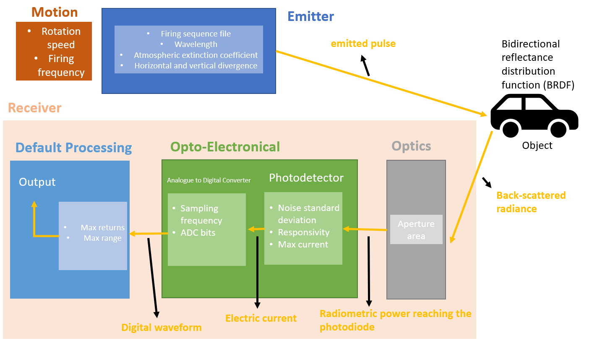

# LiDAR Sensor Modeling

The process of creating the KITTI LiDAR model is achieved using the Ansys AVxcelerate Sensors Simulator (AVX). This simulator, with its Sensor Modeler interface, provides a variety of sensor models, enabling us to develop a custom sensor model.

The investigation mainly revolves around a rotating LiDAR system. The sensor assembly is affixed to a platform and comprises of two grayscale and two color cameras, a 3D rotating laser scanner, and a combined GPS/IMU navigation system.

The principal object of interest is the 3D rotating laser scanner, specifically, the Velodyne HDL-64E. It operates at 10 Hz with 64 beams, an angular resolution of 0.09°, a distance accuracy of 2 cm, and collects approximately 1.3 million points per second. It has a field of view of 360° horizontally, 26.8° vertically, and a range of 120m.

*Figure 1: Overview of Parameters Within the AVX Components.*

## Motion

The dynamic behavior of the system is encapsulated in this section. The dynamic motion of the rotating LiDAR system is modeled using two parameters: Rotation Speed and Firing Frequency.

Rotation Speed measures the rotational speed of the LiDAR, quantified in rotations per second. This value is set to 10 Hz.

Firing Frequency signifies the number of 'fans' the LiDAR system emits per second. Based on the data, there exists a 57.6 μs interval between two successive firings of the same laser, equating to a firing frequency of 17 361.11 Hz. After rounding, this value is set to 17 361 Hz.

## Emitter

The Emitter module within the AVX workflow includes a set of key parameters:

1. **Firing Sequence File**: This text file determines the sequential firings or 'flashes' that shape the fan pattern of the emitter. While the firing sequence is not provided by Velodyne, the manufacturer of the LiDAR system, a firing sequence file is retrieved from the Ansys Database for this model.

2. **Wavelength**: This parameter denotes the wavelength of the emitted laser beam. The wavelength for this LiDAR model is set at 905 nm.

3. **Atmospheric Extinction Coefficient**: The atmospheric extinction coefficient accounts for the loss of energy experienced by a laser beam as it propagates through the atmosphere due to factors such as scattering and absorption. For this model, the atmospheric extinction coefficient is set at 0.161km⁻¹.

4. **Horizontal and Vertical Divergence**: These terms define the spread of the emitted laser beam in their respective planes. The divergence represents the increase in beam diameter with the distance from the optical aperture. Default values recommended by the software (0.002 rad for both horizontal and vertical divergence) were used in this model due to the lack of explicit beam angle measurements.

## Optics

The Optics component functions to convert the back-scattered radiance into radiometric power after accounting for interactions with object materials in the scene.

The parameter set for this component includes:

1. **Aperture Area**: The receiver’s aperture area is the surface area of the opening that collects returning laser signals after they have bounced off objects. A larger aperture area can collect more light, thereby enhancing the signal-to-noise ratio and improving the LiDAR system’s overall sensitivity. The value for the aperture area suggested by the Ansys Database, which is 100 000mm², was used in this model.

## Opto-Electrical

The 'Opto-Electrical' module in the AVX system converts the radiometric power received by the 'Photodetector' into an electrical current. Further, this module transforms this electrical current into a digital waveform via the 'Analogue to Digital Converter (ADC)'.

Key parameters in this module are:

1. **Noise Standard Deviation**: This parameter reflects the variation in the electrical noise associated with the analog opto-electronics. In this model, the default value of 10 nA from the Ansys Database was utilized.

2. **Responsivity**: This parameter characterizes the efficiency of a photodiode to transform the incident light into an electrical current. A higher responsivity signifies a more efficient conversion of light into an electrical signal. In this model, the default value of 1 AW⁻¹ was used.

3. **Max Current**: The max current is the upper limit of the output current that the photodiode can generate. A high value of 100 000mA was used in this model to prevent any potential saturation.

4. **Sampling Frequency**: The sampling frequency parameter denotes how frequently the analog signal is converted into a digital format by the ADC. A corresponding sampling frequency of 15GHz was adopted for this model.

5. **ADC Bits**: The ADC bit resolution is the number of bits used by the ADC to represent the amplitude of the signal. In this model, the bit resolution was set to 32.

## Default Processing

The 'Default Processing' module primarily transforms digital waveforms into valuable output metrics, specifically Time of Flight and Intensity. 

Key parameters in this module are:

1. **Max Returns**: The 'Max returns' parameter sets the maximum number of detectable returns per laser pulse. In this model, the system defaults to 1, recording only the first detected reflection for each laser pulse.

2. **Max Range**: 'Max range' indicates the furthest distance where a LiDAR sensor can reliably detect and measure objects. This parameter has been designated a value of 120m for the present simulation.

Please refer to the [full thesis document](./aydin_uzun_ms_thesis.pdf) for a comprehensive understanding of the system’s parametrization and detailed overview.