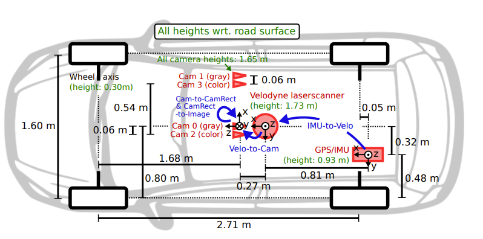

## Sensor Layout and Configuration

The positioning and orientation of the sensor in AVX draw inspiration from the sensor setup in the KITTI dataset to maintain consistency. 

As demonstrated in Figure 1, the sensor setup in the KITTI dataset places the laserscanner 1.73m above the ground and 0.76m longitudinally from the vehicle's rear axis. This exact translation was applied to the LiDAR model.

**Figure 1:** The sensor setup from the KITTI data set. The sensor (depicted in red) dimensions and mounting positions are illustrated in relation to the vehicle body. Heights above ground (shown in green) are measured concerning the road surface. Sensor transformations are highlighted in blue. *(Image credit: Geiger et al., 2013. [Vision meets Robotics: The KITTI Dataset](https://www.cvlibs.net/publications/Geiger2013IJRR.pdf), International Journal of Robotics Research (IJRR))*

A noteworthy point is the distinction in the ego vehicle used in the simulations from the one used in the KITTI database, the VW Passat station wagon. Due to the unavailability of the asset file detailing the VW Passat's physical attributes for AVX, an alternative vehicle, the 2010 Audi A1 in blue, was chosen.

However, the selection of the ego vehicle model or color doesn't significantly affect the LiDAR sensor simulation. The sensor's main role is to capture its surroundings, and any point cloud data from the ego vehicle is filtered out during preprocessing before feeding it into the neural network.

Please refer to the [full thesis document](./aydin_uzun_ms_thesis.pdf) for a comprehensive understanding.